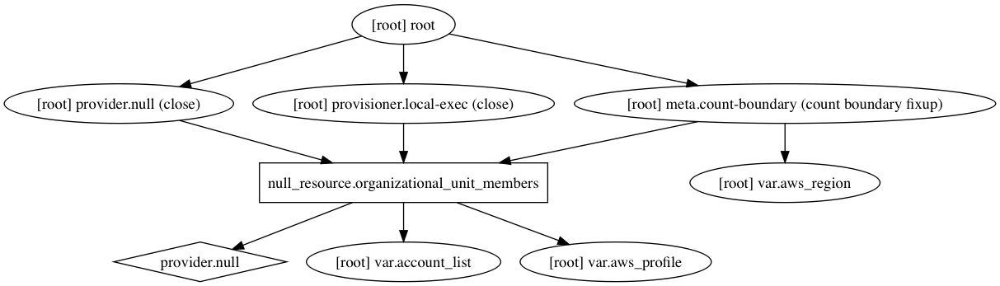

# terraform-aws-organizational-unit-members

[](https://circleci.com/gh/devops-workflow/terraform-aws-organizational-unit-members)
[](https://github.com/devops-workflow/terraform-aws-organizational-unit-members/releases)

Terraform module to move member accounts to the right organizational units

This is assumed to be a temporary implementation until OU support is added to Terraform


[Terraform registry](https://registry.terraform.io/modules/devops-workflow/organizational-unit-members/aws)

## Usage

### Basic Example

```hcl
module "organizational-unit-members" {
  source        = "devops-workflow/organizational-unit-members/aws"
  version       = "0.0.1"
  aws_profile   = "master"
  account_list  = "1111:core 1234:environments 2345:core"
}
```

<!-- BEGINNING OF PRE-COMMIT-TERRAFORM DOCS HOOK -->
## Inputs

| Name | Description | Type | Default | Required |
|------|-------------|:----:|:-----:|:-----:|
| account\_list | List of member account and organizational units they should be into. Format: {account id}:{ou name} {account id}:{ou name} | string | - | yes |
| aws\_profile | AWS profile in local credentials file that has rights to master account | string | - | yes |
| aws\_region | AWS region | string | `us-east-1` | no |

<!-- END OF PRE-COMMIT-TERRAFORM DOCS HOOK -->
<!-- BEGINNING OF PRE-COMMIT-TERRAFORM GRAPH HOOK -->

### Resource Graph of plan


<!-- END OF PRE-COMMIT-TERRAFORM GRAPH HOOK -->
